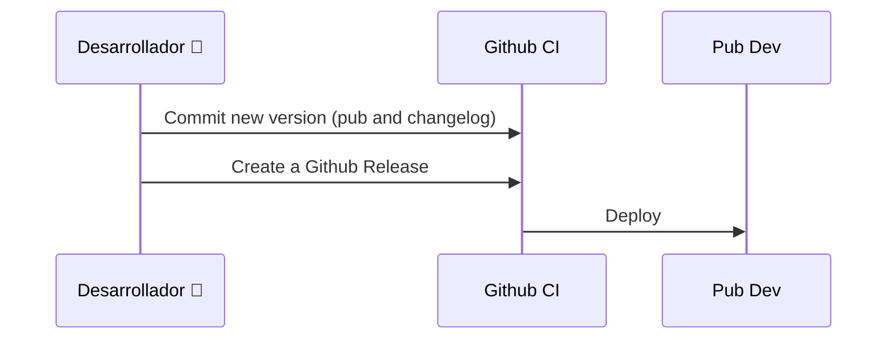

# Deploys 
Each version will be described on:
- [Github Releases](https://github.com/SpringCare/iterable_flutter/releases)
- [CHANGELOG.md](https://github.com/SpringCare/iterable_flutter/blob/main/CHANGELOG.md)

## How to

